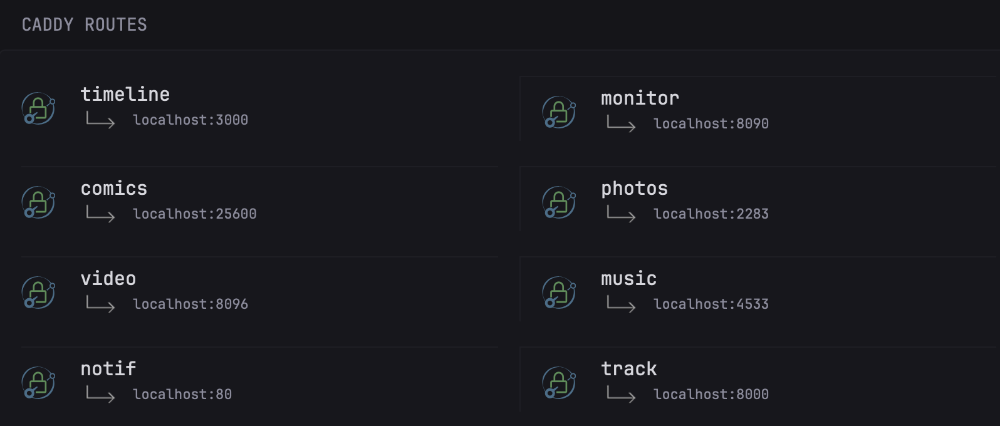
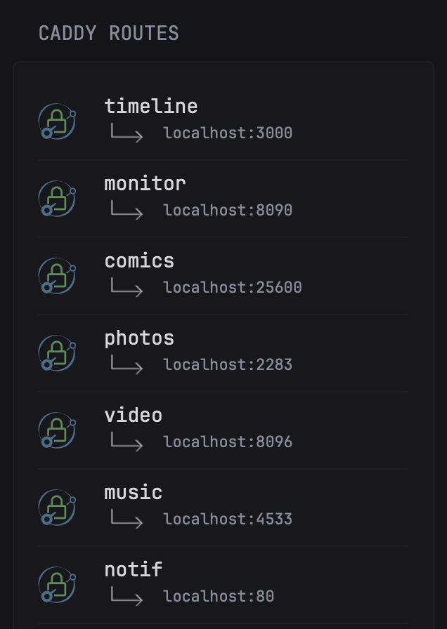

# Caddy Routes

This widget displays [Caddy](https://caddyserver.com) external and local links to your services proxied through Caddy.

The widget is modeled after the [cloudflare tunnels widget](https://github.com/glanceapp/community-widgets/blob/main/widgets/cloudflared-tunnels/README.md). Should work well in both full and small columns layouts.

<details>
  <summary>Full column preview</summary>
  
</details>

<details>
  <summary>Small column preview</summary>
  
</details>

```yaml
- type: dynawidgets
  widget: caddy-routes
  css-class: "widget-type-caddy"
  cache: 4h
  options:
    domain_name: ".example.com"
    icon_url: "https://cdn.jsdelivr.net/gh/homarr-labs/dashboard-icons/svg/caddy.svg"
    local_ip: "localhost"
    docker: false
  title: Caddy Routes
```

## Environment Variables

`CADDY_ADMIN_URL` - In the format of `address:port`. Usually this is `localhost:2019`, but see the [caddy docs](https://caddyserver.com/docs/api) for more info.
`CADDY_SERVER_NAME` - this is the name of your caddy server. If you manually created a JSON file for Caddy you probably know it, if you are using Caddy with docker, this is usually `srv0` (see also below).

If you have multiple servers block in your config file (either Caddyfile or JSON file), you should be able to add multiple servers by reusing the widget and specifying a different url, e.g.:

`url: http://${CADDY_ADMIN_URL}/config/apps/http/servers/srv0/routes`
`url: http://${CADDY_ADMIN_URL}/config/apps/http/servers/example/routes`

You can find your server(s) name by running the following command (with `jq`):

```bash
curl http://YOURIP:2019/config/apps/http/servers/ | jq 'keys'
```

## Options

| Option | Default | Description |
| :--- | :--- | :--- |
| `domain_name` | `.example.com` | Base domain suffix (with leading `.`) trimmed from displayed service names |
| `icon_url` | `https://cdn.jsdelivr.net/gh/homarr-labs/dashboard-icons/svg/caddy.svg` | URL of the icon shown next to each service. Can be selfhosted e.g. `assets/img/caddy.svg` |
| `local_ip` | `localhost` | IP or hostname used to build clickable local service links, formatted as `IP:Port` |
| `docker`   | `false` | If `true`, shows raw container addresses without links, if `false`, shows clickable internal links |

> **NOTE:** When `docker: false`, the port used in the local link is the one configured in Caddy's reverse proxy, so to resolve the link correctly, the port need to be reachable/open. If you are using Docker with a VPN/Tailscale, you can still get clickable internal links by setting `docker: false` and `local_ip` to your VPN/Tailscale IP or domain.

## Assets

Upload to your dynacat `assets` folder.

1. <a href="images/link-down-right.png">images/link-down-right.png</a> file

> Arrow icon is sourced from the original [cloudflare tunnels widget](https://github.com/glanceapp/community-widgets/blob/main/widgets/cloudflared-tunnels/link-down-right.png).
