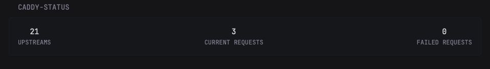
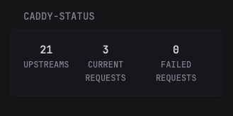

# Caddy Status

This widget displays [Caddy](https://caddyserver.com) reverse proxy status, in particular: upstreams, current requests, and failed requests.

The widget is modeled after the [homepage caddy widget](https://gethomepage.dev/widgets/services/caddy/), and uses a similar structure to the Immich widget. Should work well in both full and small columns layouts.




```yaml
- type: custom-api
  title: Caddy Status
  update-interval: 1m
  url: http://${CADDY_ADMIN_URL}/reverse_proxy/upstreams
  template: |
    {{ $upstreams := .JSON.Array "" }}
    {{ $requests := 0 }}
    {{ $fails := 0 }}
    {{ range $upstreams }}
      {{ $requests = add $requests (.Int "num_requests") }}
      {{ $fails = add $fails (.Int "fails") }}
    {{ end }}
     <div class="flex justify-between text-center">
       <div class="flex-1">
          <div class="color-highlight size-h3"> {{ len ($upstreams) }} </div>
         <div class="size-h6">UPSTREAMS</div>
       </div>
       <div class="flex-1">
         <div class="color-highlight size-h3">{{ $requests }}</div>
         <div class="size-h6">CURRENT REQUESTS</div>
       </div>
       <div class="flex-1">
         <div class="color-highlight size-h3">{{ $fails }}</div>
         <div class="size-h6">FAILED REQUESTS</div>
       </div>
    </div>
```

## Environment Variables

`CADDY_ADMIN_URL` - In the format of `address:port`. Usually this is `localhost:2019`, but see the [caddy docs](https://caddyserver.com/docs/api) for more info.
