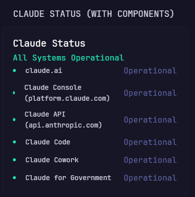

# Claude Status with Components

Displays Claude's overall service health and grouped components from the
official Claude Status page.

## Preview



## Configuration

```yaml
- type: dynawidgets
  widget: claude-status-components
  title: Claude Status
  cache: 2m
```

The widget uses Claude's public Statuspage summary endpoint and needs no
credentials.
