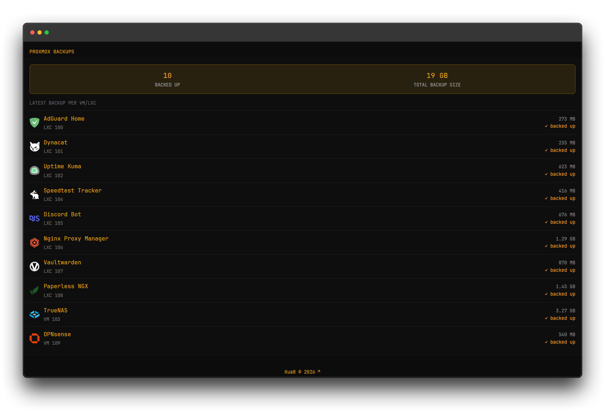

# Proxmox Backups

Summarizes VM/LXC backups sitting on a single Proxmox Backup Server storage: total guests backed up, total backup size, and the latest backup per guest — each row links straight into that guest's console in the Proxmox web UI.



No extra server required — Dynacat calls the Proxmox API directly at render time.

## Requirements

- A Proxmox VE host with a backup storage (e.g. a Proxmox Backup Server datastore) attached
- A Proxmox API token with read access to that storage's content — create one under **Datacenter → Permissions → API Tokens** (a token on a role with `Datastore.Audit` is enough)

## Configuration

```yaml
- type: dynawidgets
  widget: dynacat-proxmox-backups
  title: Proxmox Backups
  cache: 5m
```

## Environment Variables

| Variable | Description |
|---|---|
| `PROXMOX_HOST` | Your Proxmox host or IP, without scheme or port (e.g. `10.10.10.10` or `proxmox.example.com`) — the API is always queried on port `8006` |
| `PROXMOX_NODE` | The Proxmox node name (visible in the Proxmox UI sidebar, often just `pve`) |
| `PROXMOX_STORAGE` | The name of the backup storage to read from (Datacenter → Storage) |
| `PROXMOX_API_TOKEN` | Everything after `PVEAPIToken=` for your token, i.e. `user@realm!tokenid=secret-uuid` |
| `PROXMOX_WEB_URL` | The URL you actually use to reach the Proxmox web UI in a browser (e.g. `https://proxmox.example.com` or `https://10.10.10.10:8006`) — used only for the clickable console links, and can differ from `PROXMOX_HOST` if you sit behind a reverse proxy |

`allow-insecure: true` is set by default since most home Proxmox installs use a self-signed certificate. Remove it from the `required:` override in your own fork if your Proxmox API has a trusted cert.

## Friendly names per guest

By default every row falls back to the backup's own **notes** field (set when you name the backup job in Proxmox), then to a generic `VM <id>` / `LXC <id>` label — so this works with zero setup. If you want a specific icon and name per guest, add an `{{ if eq $vmid "..." }}` branch near the top of the template (commented example included) for each VMID you want to label — see `template.txt`.

## Caching

Defaults to `cache: 5m`, reasonable for a local API that doesn't change every minute. Lower it while testing changes.
