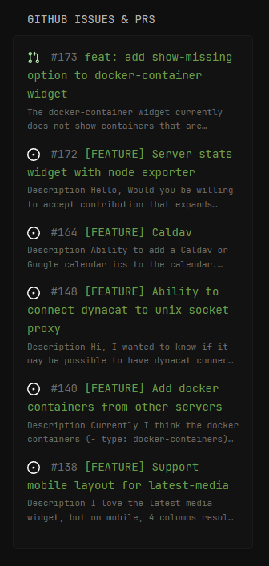

# GitHub Issues & PRs



## Configuration
```yaml
        - type: dynawidgets
          widget: github-issues-prs
          title: GitHub Issues & PRs
          cache: 10m
          update-interval: 45m
          options:
            repo: Panonim/dynacat        
            # Optional
            attribution: https://github.com/Panonim/dynacat
            show-icons: true
            state: open
            limit: 8
```

For the GitHub Issues Search API, the `state` values available for the widget are: `closed`, `open`, `all`.