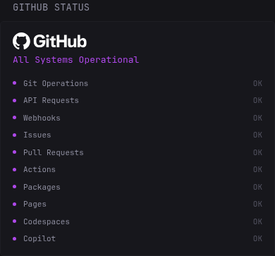
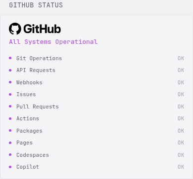

# GitHub Status with Components

Displays GitHub's overall service health and the public components listed on
GitHub Status.

## Preview





## Configuration

```yaml
- type: dynawidgets
  widget: github-status-components
  title: GitHub Status
  cache: 5m
```

The widget uses GitHub's public Statuspage summary endpoint and needs no
credentials.

## Theme-aware logo

The header uses the official GitHub Invertocat and wordmark lockup at 24px
high, in white on dark themes and black on light themes. It follows Dynacat's
`data-scheme` attribute rather than the browser or operating system preference.
The SVGs are embedded in the template so no extra asset hosting is required.
Status colours and component filtering are unchanged.

## Artwork and fonts

The SVG artwork embedded in `template.txt` comes from the
[GitHub Brand Toolkit logo pack](https://brand.github.com/GitHub_Logos.zip).
GitHub retains the copyright and trademark rights to its logo. The artwork is
used here to identify and link to GitHub Status under GitHub's
[permitted logo-use guidance](https://brand.github.com/foundations/logo);
it is not relicensed under the repository's software licence or a font licence.

The wordmark is outlined SVG artwork, not text typeset by the widget. No font
files are bundled or loaded; the remaining text inherits the Dynacat theme's
font. GitHub's brand typefaces include
[Mona Sans and Mona Sans Mono](https://brand.github.com/foundations/typography),
available under [SIL Open Font License 1.1](https://github.com/github/mona-sans/blob/main/LICENSE).
That font licence is separate from the logo's usage terms.
