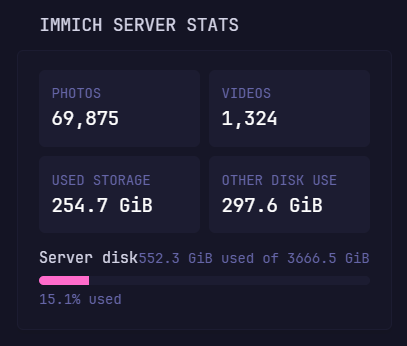

# Immich Server Stats

Displays the number of photos and videos in an Immich library together with
library usage, other disk usage, total disk capacity, and disk utilization.

The `storage` subrequest is required. The widget configuration must include the
URL, API headers, and subrequest shown below.

## Preview



## Configuration

```yaml
- type: dynawidgets
  widget: immich-server-stats
  title: Immich Stats
  cache: 10m
  url: ${IMMICH_URL}/api/server/statistics
  headers:
    x-api-key: ${IMMICH_API_KEY}
  subrequests:
    storage:
      url: ${IMMICH_URL}/api/server/storage
      headers:
        x-api-key: ${IMMICH_API_KEY}
```

## Environment variables

| Variable | Required | Description |
| --- | --- | --- |
| `IMMICH_URL` | Yes | Base URL of the Immich server, without a trailing slash. |
| `IMMICH_API_KEY` | Yes | Immich API key with permission to read server statistics and storage information. |

Keep the API key in Dynacat's environment or secrets configuration rather than
placing it directly in the dashboard YAML.
