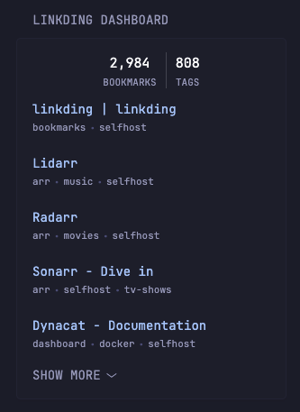
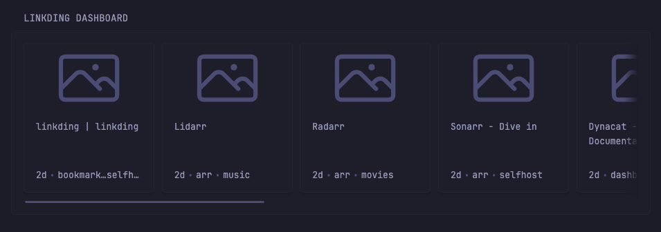

# Linkding Dashboard

This widget displays number of Bookmarks, number of Tags, and the most recent bookmarks (configurable) of your [Linkding](https://linkding.link/) instance. In `horizontal` layout it shows the most recent bookmarks only.

For the horizontal layout, the widget used the Glance [Karakeep Dashboard](https://github.com/glanceapp/community-widgets/tree/main/widgets/karakeep-dashboard) as base for the code, plus some style and ideas from the [Linkwarden latests](https://github.com/glanceapp/community-widgets/tree/main/widgets/linkwarden-latest-bookmarks) widget.

For the horizontal layout, the widget uses the `horizontal-cards` layout available for the dynacat [rss widget](https://dynacat.artur.zone/#configuration/rss).

<details>
<summary>Small column layout</summary>

</details>

<details>
<summary>Full column layout</summary>

</details>

## Configuration

### Vertical Layout

```yaml
- type: dynawidgets
  widget: linkding-dashboard
  title: Linkding Dashboard
  cache: 30m
  limit: 10
  options:
    collapse-after: 5
    in-new-tab: true
    layout: vertical
```

### Horizontal Layout

```yaml
- type: dynawidgets
  widget: linkding-dashboard
  title: Linkding Dashboard
  cache: 30m
  limit: 10
  options:
    in-new-tab: true
    layout: horizontal
    thumbnail-height: 10
```

## Environment Variables

`LINKDING_URL` - the link to your Linkding instance, e.g. `https://links.example.com`

`LINKDING_TOKEN` - API token of your Linkding instance. You can get it from `yourinstanceurl/settings/integrations#rest-api-heading `.
