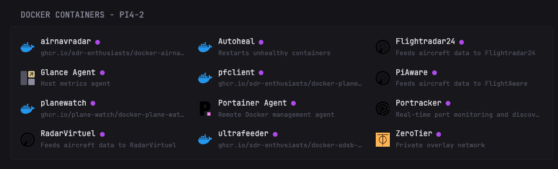

# Portainer Container List

Displays containers from a remote Portainer environment without requiring
Dynacat to connect to an exposed Docker socket. Container names, descriptions,
and links use `dynacat.*` labels when available, with backward-compatible
support for `glance.*` labels.

## Preview



## Configuration

```yaml
- type: dynawidgets
  widget: portainer-container-list
  title: Remote Docker Containers
  cache: 1m
  url: "${PORTAINER_URL}/api/endpoints/${PORTAINER_ENDPOINT_ID}/docker/containers/json?all=0"
  headers:
    X-API-Key: ${PORTAINER_API_KEY}
```

The URL must be present in the widget configuration. Change `all=0` to `all=1`
to include stopped containers. If Portainer uses a self-signed certificate,
add:

```yaml
  allow-insecure: true
```

## Environment variables

| Variable | Required | Description |
| --- | --- | --- |
| `PORTAINER_URL` | Yes | Base URL of the Portainer server, without a trailing slash. |
| `PORTAINER_ENDPOINT_ID` | Yes | Numeric identifier of the Portainer environment to display. |
| `PORTAINER_API_KEY` | Yes | Portainer access token with permission to list containers. |

Keep the API key in Dynacat's environment or secrets configuration rather than
placing it directly in the dashboard YAML.
