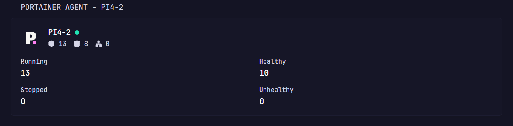

# Portainer Endpoint Summary

Displays the connection state and recent Docker snapshot counts for one
Portainer environment.

## Preview



## Configuration

```yaml
- type: dynawidgets
  widget: portainer-endpoint-summary
  title: Portainer Environment
  cache: 5m
```

The URL must be present in the widget configuration. If Portainer uses a
self-signed certificate, add:

```yaml
  allow-insecure: true
```

## Environment variables

| Variable | Required | Description |
| --- | --- | --- |
| `PORTAINER_URL` | Yes | Base URL of the Portainer server, without a trailing slash. Must be prefixed with either `https://` or `http://` |
| `PORTAINER_ENDPOINT_ID` | Yes | Numeric identifier of the Portainer environment to display. |
| `PORTAINER_API_KEY` | Yes | Portainer access token with permission to read the environment. |

Keep the API key in Dynacat's environment or secrets configuration rather than
placing it directly in the dashboard YAML.

