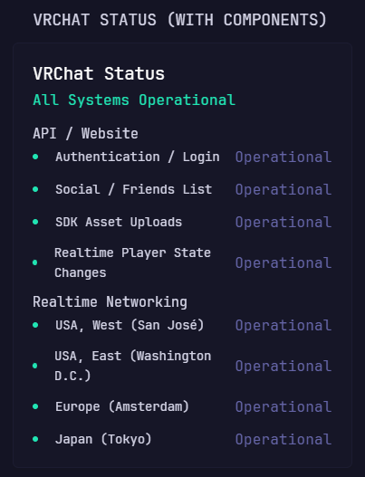

# VRChat Status with Components

Displays VRChat's overall service health and grouped components from the
official VRChat Status page.

## Preview



## Configuration

```yaml
- type: dynawidgets
  widget: vrchat-status-components
  title: VRChat Status
  cache: 2m
```

The widget uses VRChat's public Statuspage summary endpoint and needs no
credentials.
