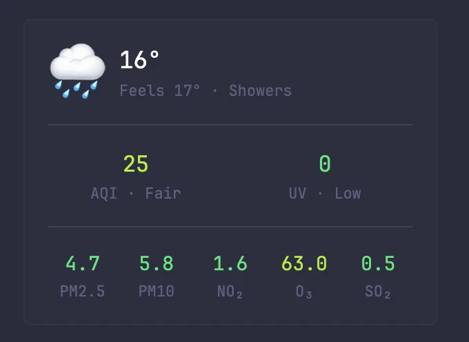
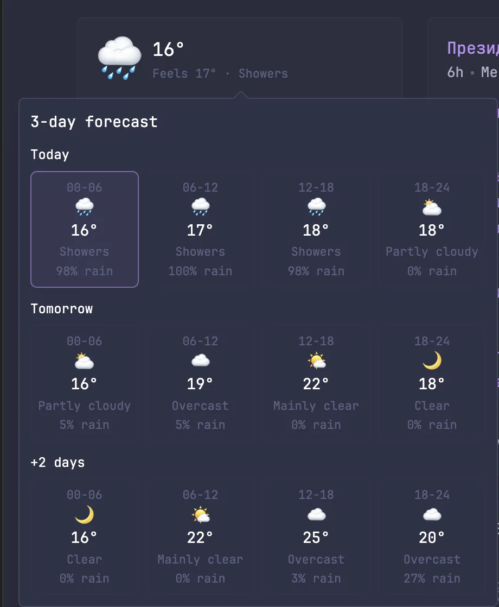
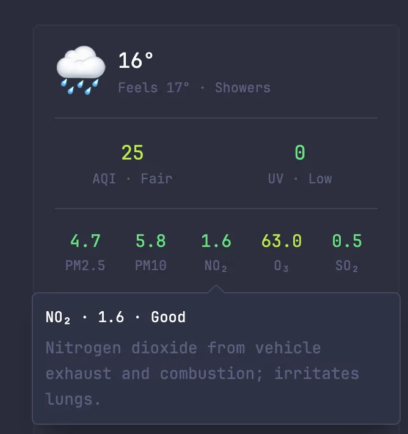

# Weather with Air Quality and 3-days forecast

The widget uses [Open-Meteo Forecast API](https://open-meteo.com/en/docs) and [Open-Meteo Air Quality API](https://open-meteo.com/en/docs/air-quality-api). No API key is required.

## Preview



Full widget layout with current temperature, feels-like temperature, AQI, UV, and pollutant values.



Forecast hover with today plus the next two days, grouped into 6-hour cards with subtle current-time highlighting.



Metric hover details with the measured value, status label, and a short explanation separated from the heading.

## Usage

```yaml
- type: dynawidgets
  widget: weather-air-quality-3-day-forecast
  title: Weather & Air
  cache: 10m
  update-interval: 15m
```

Optional settings can be hardcoded or driven by environment variables:

```yaml
  options:
    hide-air-quality: ${WEATHER_HIDE_AIR_QUALITY}
    hide-forecast: ${WEATHER_HIDE_FORECAST}
```

Omit these option lines if you do not use the corresponding environment variables. By default, both air quality and forecast are shown.

## Environment Variables

| Variable                   | Description                                                                |
| -------------------------- | -------------------------------------------------------------------------- |
| `WEATHER_LATITUDE`         | Latitude for the forecast and air-quality requests                         |
| `WEATHER_LONGITUDE`        | Longitude for the forecast and air-quality requests                        |
| `WEATHER_HIDE_AIR_QUALITY` | Optional `true`/`false`; hides AQI, UV, and pollutant sections when `true` |
| `WEATHER_HIDE_FORECAST`    | Optional `true`/`false`; disables the 3-day forecast hover when `true`     |

## Notes

- Hover the top weather area to see the 3-day forecast in 6-hour blocks.
- The current block for today is subtly highlighted.
- Already-passed blocks for today are slightly faded.
- Hover AQI, UV, or pollutant values for a short status and description.
- If `hide-air-quality` is `true`, you can omit the `subrequests.air` block.

## API Reference

- Forecast: `GET https://api.open-meteo.com/v1/forecast`
- Air quality: `GET https://air-quality-api.open-meteo.com/v1/air-quality`
